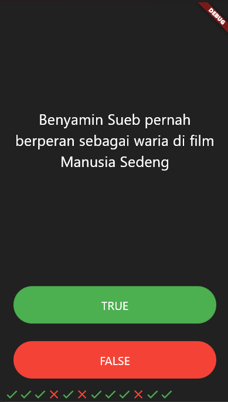

# 🧠 Quizzler App

Quizzler adalah aplikasi kuis berbasis Flutter sederhana yang menampilkan pertanyaan-pertanyaan benar/salah kepada pengguna. Pengguna dapat menjawab pertanyaan dan melihat skor di bagian bawah layar. Ketika semua pertanyaan sudah selesai, akan muncul peringatan (alert) menggunakan **rflutter_alert** untuk memberi tahu jumlah jawaban benar dan salah.

---

## ✨ Fitur Utama
- 📝 Menampilkan pertanyaan benar/salah secara berurutan.
- ✅ Menampilkan icon benar (check) atau salah (close) sesuai jawaban.
- 🔄 Reset kuis ketika sudah selesai.
- ⚠️ Alert pop-up menggunakan `rflutter_alert` ketika kuis selesai.
- 📊 Menampilkan jumlah jawaban benar dan salah.

---

## 📸 Hasil Project
 

---
